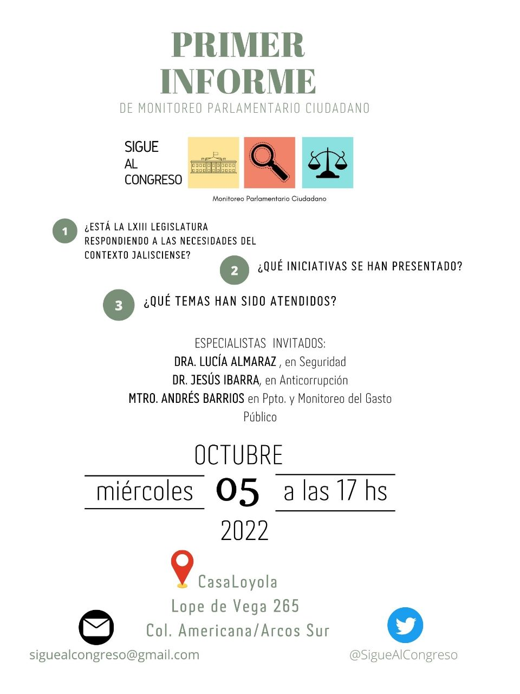

&nbsp;
<!--more-->

Se llevó a cabo el 5 de octubre del 2022, con los siguientes temas:

- ¿Qué es Sigue al Congreso?
- ¿Qué observamos?
- ¿Por qué es importante seguir al Congreso?
- Presentación de la plataforma para el monitoreo de las iniciativas
- Pendientes en los temas de Seguridad, Anticorrupción y
  Presupuesto con la participación de especialistas invitados

[Haz clic](presentacion.pdf) para ver la presentación (PDF con 34 láminas).

Se publicaron notas en varios medios locales





:



La invitación que se envió:

## Referencias


