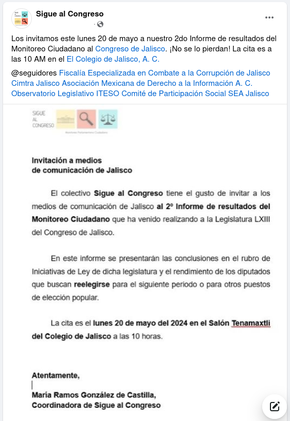
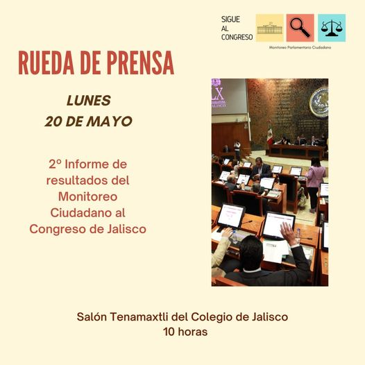

&nbsp;
<!--more-->

Se llevó a cabo el lunes 20 de mayo de 2024 a las 10 horas en El
Colegio de Jalisco.

[Documento](informe-SAC-a-medios.pdf) del informe con las secciones
Introducción, Metodología, Comentarios y Conclusiones (PDF, 11 páginas)

[Análisis](analisis-de-partidos-en-Congreso-de-Jalisco.pdf) de los partidos en el Congreso de Jalisco (PDF, 7 páginas).

[Prioridades educativas](2022-11-25-legislatura-LXIII-prioridades-educativas.pdf) en la Legislatura LXIII (PDF, 4 páginas).

[Video](https://www.facebook.com/story.php?story_fbid=765061759087511&id=100067510824351&mibextid=xfxF2i&rdid=tkLnpl4sDcIFKllw) de la sesión disponible en FaceBook (20 minutos de duración).

La invitación:

