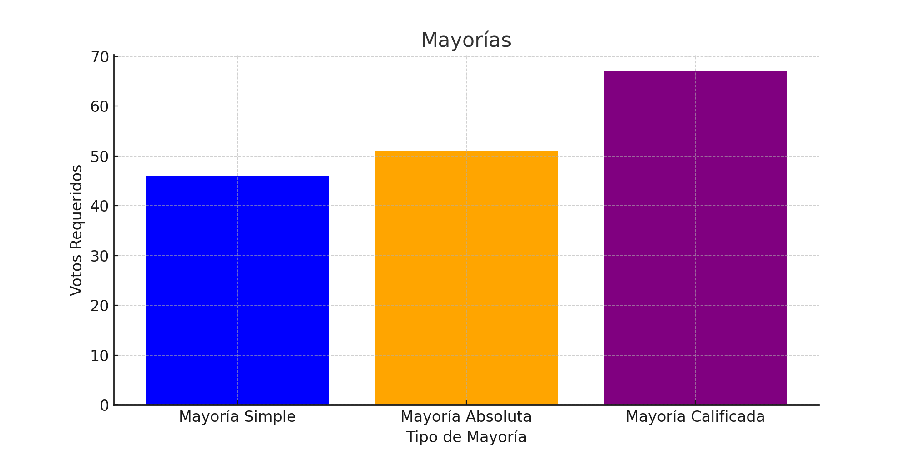

Conoce como funcionan los diferentes tipos de votaciones y aprende los diversos tipos de mayorias.
<!--more-->
# **Métodos de votación**
| Método       | Cómo se hace                                                                                                             | ¿El voto es secreto? |
|--------------|--------------------------------------------------------------------------------------------------------------------------|----------------------|
| Nominal      | Es a través de un sistema electrónico de votación. Cuando el sistema no esté disponible entonces el Secretario General va pasando lista a los diputados y estos responden con su voto verbalmente. | No                   |
| Por cédula   | Se deposita una papeleta en una urna                                                                                      | Sí                   |
| Económica    | Los diputados levantan la mano para indicar su voto                                                                       | No                   |
{ class="table table-striped-columns table-hover table-bordered" }

Este es un video donde se explica cómo funciona el voto nominal mediante el sistema electrónico de votación. Tiene una duración de 2 minutos y 35 segundos.


# **Tipos de mayoría**

| Tipo              | Proporción                        | Conjunto sobre el que se aplica la proporción                                                      |
|-------------------|-----------------------------------|----------------------------------------------------------------------------------------------------|
| Mayoría simple    | Más de la mitad de los votos emitidos | Votantes presentes [1]                                                                              |
| Mayoría absoluta  | Más de la mitad del total de miembros | Total de miembros                                                                                   |
| Mayoría calificada| Dos terceras partes de los miembros  | Total de miembros                                                                                   |
{ class="table table-striped-columns table-hover table-bordered" }

[1] La ley dice “diputados presentes” en la definición de mayoría simple, pero también establece: “para la determinación de los resultados correspondientes sólo se computan los votos a favor y en contra”. La segunda condición restringe el conjunto sobre el que se aplica la proporción a los diputados presentes y que votan.

## **Mayorías**

### Ejemplo de Mayorías

| Tipo de Mayoría       | Total de miembros | Votos requeridos |
|-----------------------|-------------------|------------------|
| Mayoría Simple        | 90                | 46               |
| Mayoría Absoluta      | 100               | 51               |
| Mayoría Calificada    | 100               | 66               |
{ class="table table-striped-columns table-hover table-bordered" }

## **Eventos y votaciones**

Abreviaciones: MS = mayoría simple; MA = mayoría absoluta; MC = mayoría calificada

| Evento                                                                                              | Tipo de mayoría | Método            |
|-----------------------------------------------------------------------------------------------------|-----------------|-------------------|
| Integración de la Mesa Directiva                                                                    | MA              | Votación nominal  |
| Orden de la presidencia de la Mesa Directiva                                                        | MS              | No especificado   |
| Remoción de algún integrante de la Mesa Directiva                                                   | MA              | Votación nominal  |
| Elección de miembros faltantes de la Mesa Directiva en una sesión                                   | MA              | Votación nominal  |
| Decisiones de la Mesa Directiva                                                                     | MA              | Votación nominal  |
| Decisiones de la Junta de Coordinación Política                                                     | MA              | Votación nominal  |
| Designación del Secretario General del Congreso                                                     | MA              | Votación nominal  |
| Remoción del Secretario General del Congreso                                                        | MA              | Votación nominal  |
| Designación del titular de cada Órgano Técnico                                                      | MS [1]          | No especificado   |
| Remoción del titular un cada órgano técnico                                                         | MA              | No especificado   |
| Integración de las comisiones                                                                       | MS [1]          | Votación nominal  |
| Remoción temporal o definitiva de un integrante de una comisión                                     | MA              | Votación nominal  |
| Aprobación de moción de trámites                                                                    | MA              | No especificado   |
| Aprobación de moción suspensiva                                                                     | MA              | No especificado   |
| Votación de acuerdos legislativos                                                                   | MS [1]          | Votación nominal  |
| Votación de dictámenes de ley o decreto                                                             | MS [1]          | Votación nominal  |
| Votación de minutas                                                                                 | MS [1]          | Votación nominal  |
| Aprobación de dictámenes de ley o decreto, o de minutas que modifican la Constitución Política del Estado de Jalisco | MC              | Votación nominal  |
| Aprobación de las actas de las sesiones                                                             | MS [1]          | Votación Económica|
| Aprobación del orden del día                                                                        | MS [1]          | Votación Económica|
| Aprobación del trámite de las comunicaciones                                                        | MS [1]          | Votación Económica|
| Designación de funcionarios                                                                         | MS [1]          | Votación por cédula|
{ class="table table-striped-columns table-hover table-bordered" }

[1] La ley no especifica qué tipo de mayoría para este evento, se entiende que es el tipo predeterminado: mayoría simple (Artículo 185 numeral 5).

## **Designaciones de funcionarios**

Abreviaciones: MS = mayoría simple; MA = mayoría absoluta; MC = mayoría calificada

| Cargo                                                                                               | Tipo de mayoría | Método            |
|-----------------------------------------------------------------------------------------------------|-----------------|-------------------|
| Designación del Auditor Superior y auditores especiales                                             | MC              | Por cédula        |
| Remoción del Auditor Superior y auditores especiales                                                | MC              | Por cédula        |
| Titulares de los Órganos Internos de Control de los organismos autónomos                            | MC              | Por cédula        |
| Fiscal General                                                                                      | MC              | Por cédula        |
| Magistrados del Supremo Tribunal de Justicia                                                        | MA              | Nominal           |
| Titulares del Consejo de la Judicatura del Poder Judicial                                           | MA              | Nominal           |
| Presidente y consejeros ciudadanos de la Comisión Estatal de Derechos Humanos                       | MA              | Nominal           |
| Presidente y comisionados del Instituto de Transparencia, Información Pública y Protección de Datos Personales | MA              | Nominal           |
| Fiscal Especializado en materia de Delitos Electorales                                              | MA              | Nominal           |
| Fiscal Especializado en Combate a la Corrupción                                                     | MA              | Nominal           |
| Procurador de Desarrollo Urbano del Estado                                                          | MA              | Nominal           |
{ class="table table-striped-columns table-hover table-bordered" }

**Fuentes:** 

[Ley Orgánica del Poder Legislativo del Estado de Jalisco](https://leyco.org/mex/jal/loplej-2018.html#t8.c7) 

[El artículo 35 de la Constitución Política del Estado de Jalisco](https://leyco.org/mex/jal/cpej-1917.html#t4.c3)

