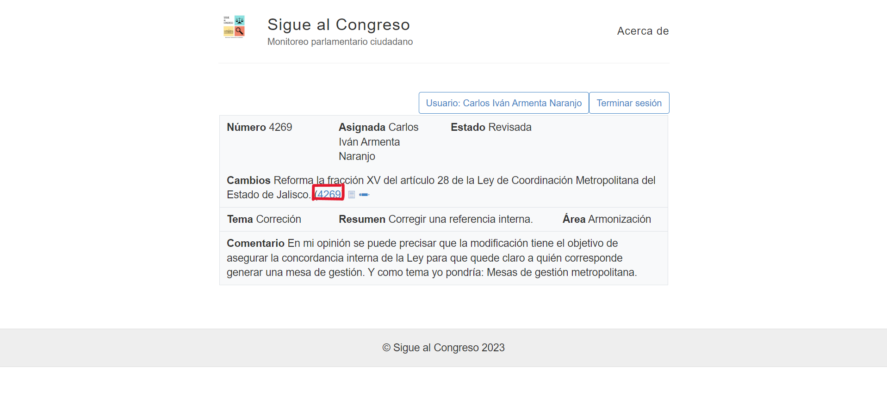
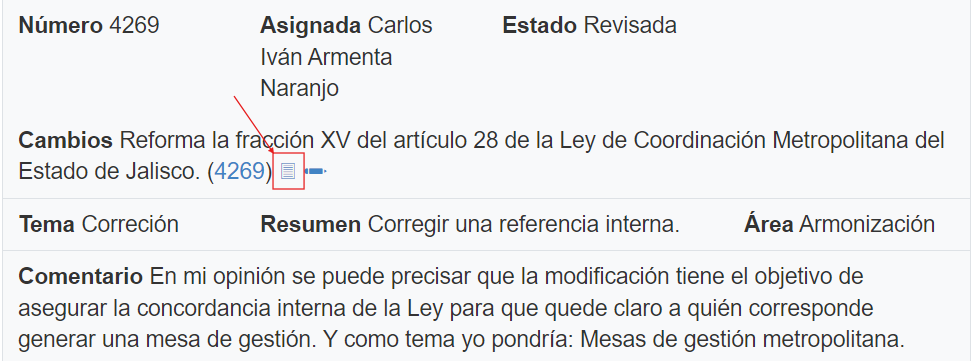
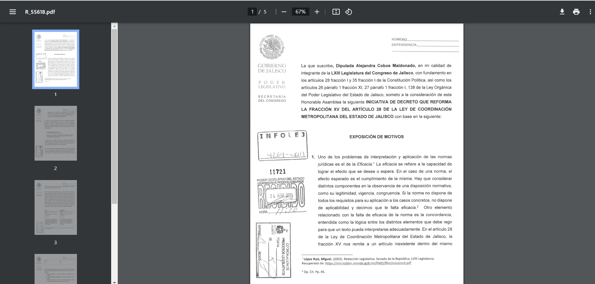
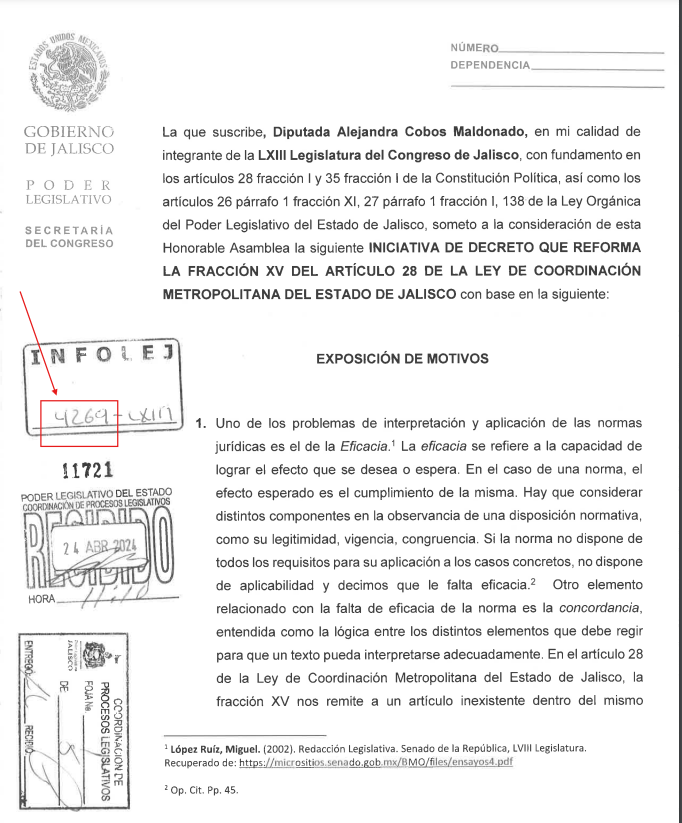

## Verificar el número de iniciativa
<!--more-->
En este paso vamos a iniciar con el proceso de hacer el resumen de una iniciativa, pero antes de empezar, te invito a revisar el siguiente link, donde se explica la estructura de una iniciativa:

[Ver la estructura de una iniciativa](https://siguealcongreso.org/docs/iniciativa/)

Primeramente despues de haber consultado el link vamos a verificar el número de iniciativa, para esto primeramente necesitamos revisar la iniciativa que nos fue asiganada por el administrador, para ello primero vamos a entrar a la aplicacion e iniciar sesión y esto nos mostrará la lista de iniciativas que tenemos asignadas, como se muestra en la siguiente imagen:

En este caso tenemos asignada la iniciativa 4269 que es la que esta resaltada en rojo en la imagen, por lo que para verlificar que en sea la correcta y que el número coincida con el de su documento, damos click en el icono del documento al lado del número y deberemos ver el documento de la iniciativa, como se muestra en las siguientes imágenes:

Ahora en el documento de la iniciativa tenemos que verificar que el numero que aparece en el sello del INFOLEG sea el mismo que el numero anterior, en este caso 4269:

En este caso el número si coincide por lo que podemos seguir con el siguiente paso:

[Ir a Paso 2](../paso-2/)