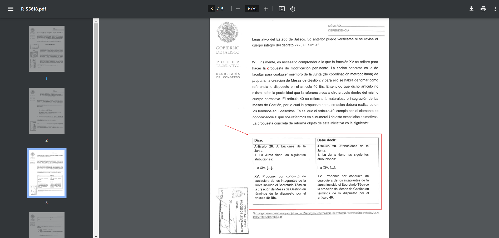

## Consultar la tabla comparativa
<!--more-->
Ahora como siguiente paso vamos a analizar los cambios propuestos para esta iniciativa, para lo cual vamos a buscar en el documento la tabla comparativa que es la seccion donde podemos identificar cuáles son los cambios realizados en esta iniciativa.

Continuando con el ejemplo del paso 1, en este caso estamos en el documento de la iniciativa 4269 y esta tabla se encuentra en la página 3 de este documento, pero esto puede variar dependiendo de la iniciativa, la tabla debe de verse de la siguiente forma en tu documento:

*Dato Importante*:

**El texto que aparece en negritas es la informacion añadida a la iniciativa original.** 

<u>El texto subrrayado es la información que remplaza a la original.</u>

~~El texto tachado es la informacion eliminada.~~

Una vez encontrada la tabla podemos ver que el texto en negritas es el que cambia en este caso eliminando el artículo 40 Bis y dejando solo el artículo 40 para este ejemplo, pero puede reflejarse cambios más grandes los cuales vendrén mostrados siempre en esta tabla, que es donde puedes analizar de qué trata la iniciativa.

Una vez realizado esto es momento de pasar al siguiente paso:

[Ir a Paso 3](../paso-3/)