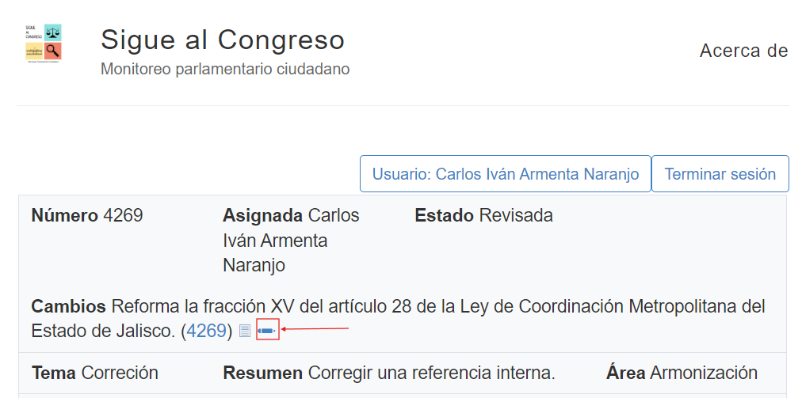
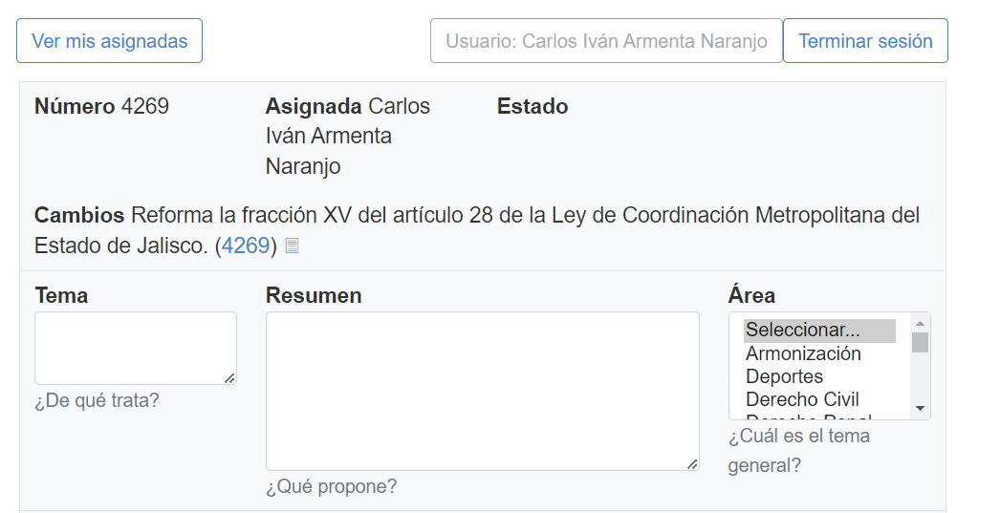
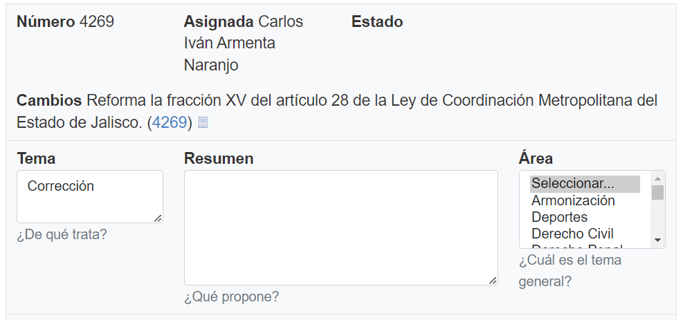

## Asignar un tema
<!--more-->
Ahora en este paso primeramente vamos a volver a la pestaña de la aplicacion, y vamos a dar click en el ícono del lapiz de editar para comenzar a llenar la iniciativa, como se muestra en las siguientes fotos:

Para poder llenar adecuadamente el campo del tema, te invito a revisar los criterios de aceptación:

[Revisar criterios de aceptacion](https://siguealcongreso.org/resumenes/criterios-para-clasificar/)

Aquí podemos ver que tenemos un campo a llenar el cual es Tema, para esto vamos a retomar el ejemplo de los pasos anteriores y nos toca la iniciativa 4269 por lo que en base a lo visto en el paso anterior vamos a asignar un tema el cual es Corrección ya que en esta iniciativa se hace una corrección de la ley, esto lo vemos reflejado en la siguiente foto:

Una vez realizado esto vamos a pasar al siguiente paso:

[Ir a Paso 4](../paso-4/)

