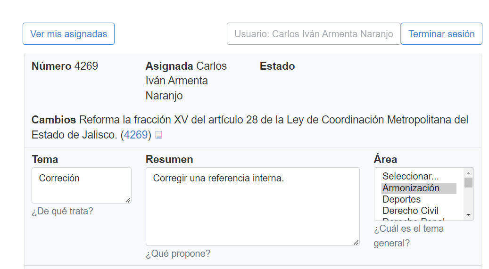

## Resumen de la inciativa
<!--more-->
 En este paso vamos a realizar el llenado del campo del formulario llamado Resumen, es aqui donde depsues de haber leido los cambios de la iniciativa tenemos que redactar el resumen de lo que ha cambiado en esta misma. Para ello te invito a revisar de nuevo el documento y los criterios de aceptacion

 [Revisar criterios de aceptacion](https://siguealcongreso.org/resumenes/criterios-para-clasificar/)

 Continuando con el ejemplo de los pasos anteriores (iniciativa 4269) vamos a poner como resumen "Corregir una referencia interna" ya que se hace el cambio de una referencia a un articulo de la misma ley, esto lo podemos ver reflejado en la siguiente foto:
 
  

 Si hemos completado este paso podemos pasar al siguiente:

 [Ir al Paso 5](../paso-5/)