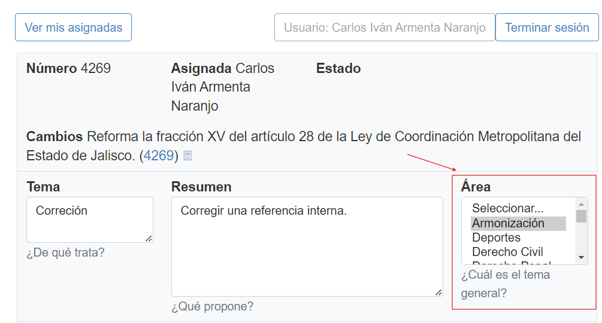
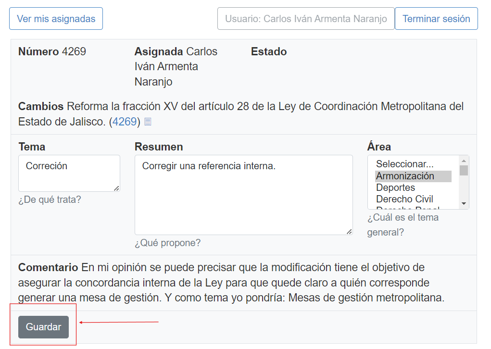

## Clasificar por Área
<!--more-->
En este paso vamos a seleccionar una de las áreas que ya existen en la página, para ello continuando con el ejemplo (iniciativa 4269) vamos a seleccionar Armonización como tema, de la lista que aparece en el formulario como se muestra en la siguiente imagen:

Una vez realizado esto podemos darle clic al botón de Guardar:

Listo, hemos terminado nuestra iniciativa.