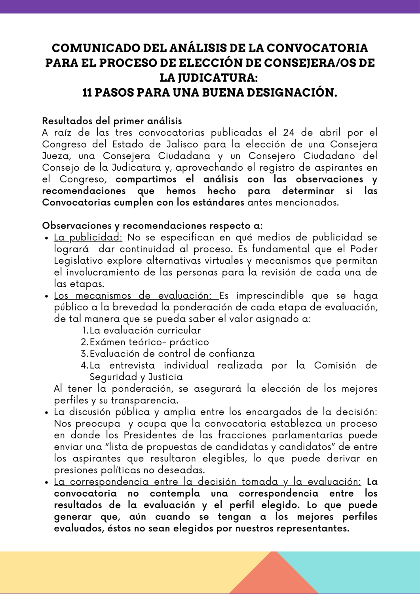
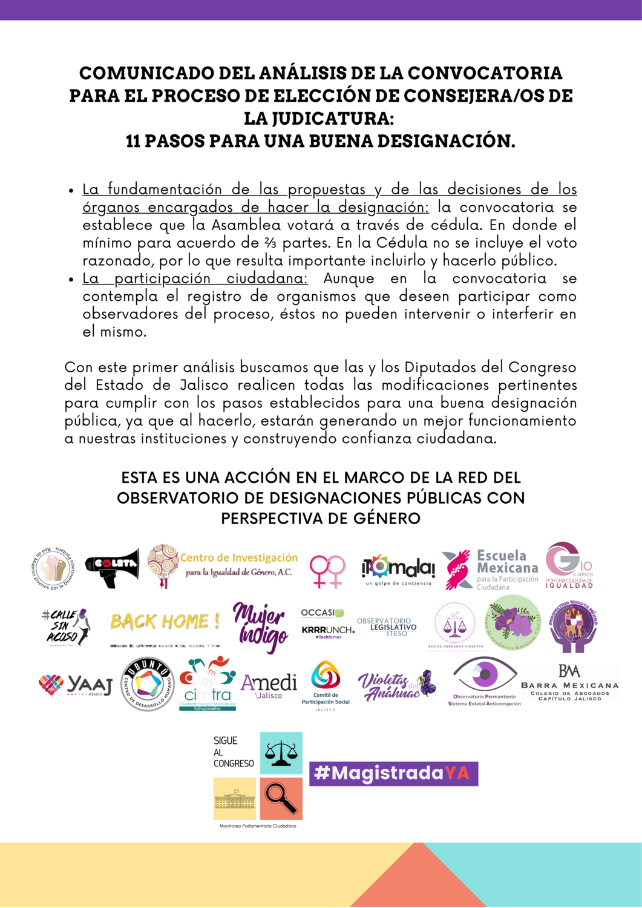

<!--more-->
A raíz de las tres convocatorias publicadas el 24 de abril por el Congreso del Estado de Jalisco para la elección de una Consejera Jueza, una Consejera Ciudadana y un Consejero Ciudadano del Consejo de la Judicatura y, aprovechando el registro de aspirantes en el Congreso, compartimos el análisis con las **observaciones y recomendaciones que hemos hecho para determinar si las Convocatorias cumplen con los estándares antes mencionados.**

Se publicó el siguiente comunicado como parte de la red del Observatorio de Designaciones Públicas con perspectiva de género:

